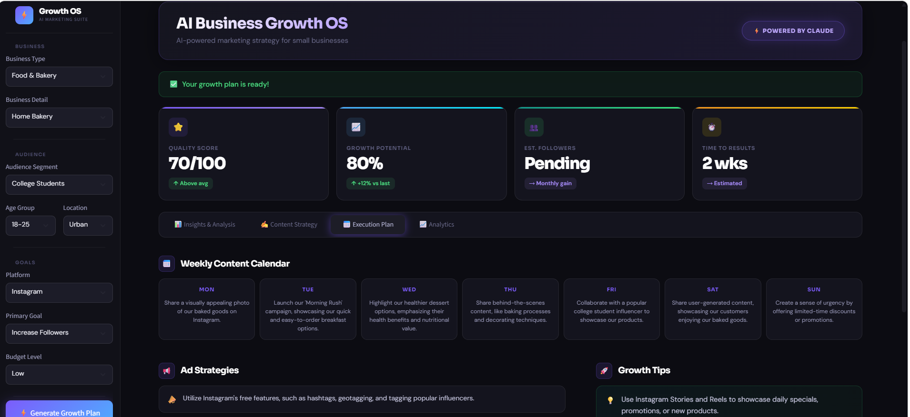
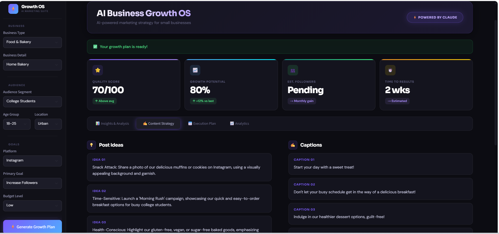
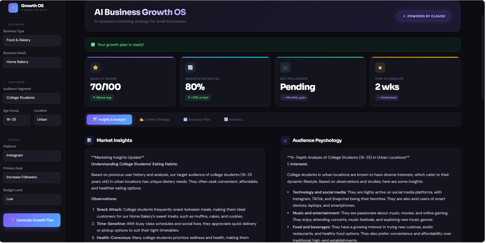

# AI Business Growth OS - Multi-Agent System

## Dashboard


## Execution Plan


## Content Strategy


## Insights & Analysis


## Overview
AI-powered real-time marketing assistant using Streamlit, Groq API, and LLMs for strategy generation and KPI dashboards.

## Features
- AI-generated marketing strategies
- Multi-agent workflow
- KPI dashboards
- Prompt engineering
- Business insights generation
- Structured JSON output parsing

## Tech Stack
- Python
- Streamlit
- Groq API
- LLMs
- JSON
- Regex

## Installation

```bash
pip install -r requirements.txt
python -m streamlit run ui.py

## Project Workflow

1. User enters business or marketing requirements
2. AI agents process the request
3. Groq API generates AI responses
4. Strategies and insights are analyzed
5. KPI dashboards are displayed in Streamlit

---

## Architecture Diagram

User Input → AI Agents → Groq API → Strategy Output → Dashboard

---

## Future Improvements

- Add memory-based AI agents
- Integrate social media APIs
- Add PDF report export
- Deploy on cloud platforms
- Add real-time analytics tracking
- Improve dashboard visualizations