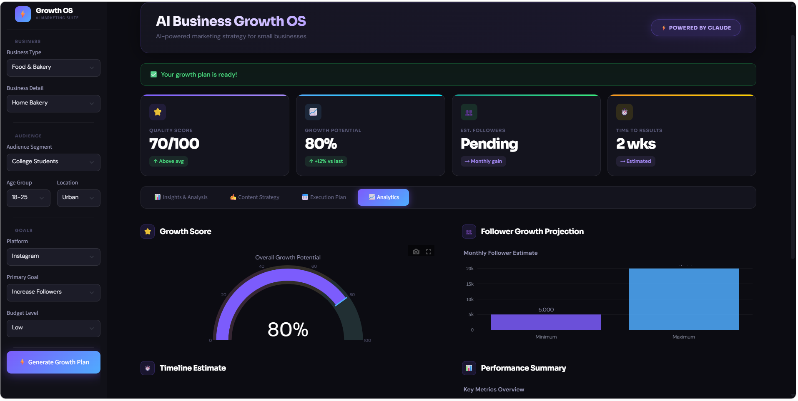

# AI Business Growth OS - Multi-Agent System



## Overview
AI-powered real-time marketing assistant using Streamlit, Groq API, and LLMs for strategy generation and KPI dashboards.

## Features
- AI-generated marketing strategies
- Multi-agent workflow
- KPI dashboards
- Prompt engineering
- Business insights generation
- Structured JSON output parsing

## Tech Stack
- Python
- Streamlit
- Groq API
- LLMs
- JSON
- Regex

## Installation

```bash
pip install -r requirements.txt
python -m streamlit run ui.py